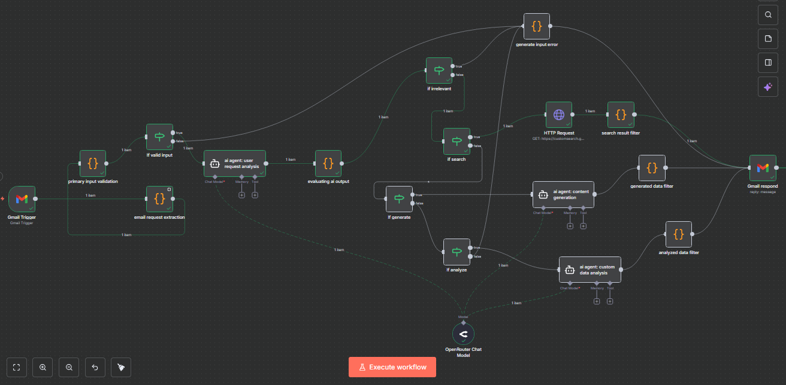

# *`email-ai-agent`*

autonomous AI email agent that reads incoming emails, decides what action to take, and responds with good formatted results.



## architecture

### workflow overview

```
Email Received → Extract Content → AI Router → Decision Branch
                                        ↓
                        ┌───────────────┼───────────────┐
                        ↓               ↓               ↓
                    SEARCH         GENERATE        ANALYZE
                        ↓               ↓               ↓
                    Google API         GPT             GPT
                        ↓               ↓               ↓
                        └───────────────┴───────────────┘
                                        ↓
                                Format Results → Send Email
```

### used stack

| Component | Technology | Purpose |
|-----------|-----------|---------|
| Automation | n8n Cloud | Workflow orchestration |
| AI Model | gpt (4.0-mini) | Decision-making & generation |
| Web Search | Google Custom Search Engine | Information retrieval |
| Email | Gmail API | Trigger & responses |


## what it does

Send an email with "TO AI:" in the subject, and the agent:
1. **Analyzes** your request using AI
2. **Decides** which action to take (search, generate, or analyze)
3. **Executes** the appropriate action
4. **Responds** with beautifully formatted results

## features

- **Autonomous Decision-Making** - AI determines the best action for each request
- **Web Search** - Finds and formats relevant information from the internet
- **Content Generation** - Creates explanations, stories, or answers
- **Data Analysis** - Analyzes and provides insights on provided data
- **Professional Email Formatting** - Clean, styled HTML responses
- **24/7 Availability** - Cloud-hosted on n8n

## demo

**Try it yourself:**
1. Send email to: `bilaleddinaoui@gmail.com`
2. Subject: `TO AI: [your request]`
3. Body: Empty/Your question or request
4. Get automated response in ~1 minute

**Example requests:**
```
TO AI: Find recent articles about machine learning
TO AI: Explain quantum computing in simple terms
TO AI: Analyze this sales data: some_data
```

## what makes it "Agentic"

Unlike traditional automation that follows fixed paths, this system:
- **Analyzes** each request independently
- **Decides** which action is most appropriate
- **Executes** different workflows based on context
- **Adapts** to various request types autonomously

## Screenshots

### Search Results


### Generated Content


### Data Analysis


## Setup & Installation

### Prerequisites
- n8n account (cloud or self-hosted)
- Gmail account
- openRouter API key (free tier available)
- Google Custom Search API key

### Installation Steps

1. **Import Workflow**
   ```bash
   # Download Email_AI_Agent.json from this repo
   # In n8n: Workflows → Import from File
   ```

2. **configure credentials**
   - Gmail OAuth (for trigger and send)
   - openrouter API key
   - Google Custom Search API + Engine ID

3. **activate workflow**
   - Click "Active" toggle in n8n
   - Test with sample email

## requirements

- **n8n:** Cloud (free tier) or self-hosted
- **openrouter API:** Free tier (14,400 requests/day)
- **Google Custom Search Engine:** Free tier (100 searches/day)
- **Gmail:** Any Gmail account

**Total Cost:** $0 for demo/testing purposes

## What I Learned

Building this project in 2 hours taught me:
- Designing multi-path agentic workflows
- Integrating multiple APIs (openrouter, Google, Gmail)
- Creating professional HTML email templates
- Implementing autonomous decision-making systems
- Deploying cloud-based automation workflows

